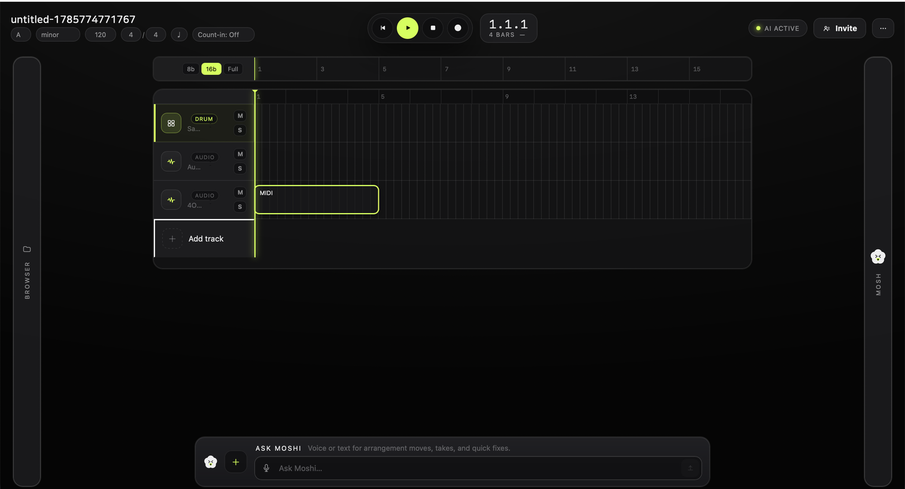

<p align="center">
  <picture><source media="(prefers-color-scheme: dark)" srcset="assets/mosh-icon-white.png"></picture>
</p>

<h1 align="center">Mosh</h1>

<p align="center">
  A native, cross-platform DAW with AI in the signal path — not bolted on.<br>
  
  <a href="ARCHITECTURE.md">Architecture</a> ·
  built by <a href="https://emiliosanchezharris.com">Emilio Sánchez-Harris</a>
</p>

---

Import/record, arrange, host **VST3/AU plugins**, mix, and export — plus a generative
tier: an offline "re-imagine" / timbre-transform render layer with semantic controls
that works on any track (MIDI/drum clips auto-bounce to audio first). A voice agent (**Moshi**) and
2-player multiplayer ride on the same command spine.

<p align="center">
  
</p>

> **macOS / Apple Silicon (arm64) is canonical.** A Windows + NVIDIA/CUDA build is an
> additive, platform-guarded port — the full PC gate (native + CUDA + packaging + e2e)
> ran green on hardware on 2026-07-16. Linux (x86_64) is a CI-tracked headless spike
> ([`.github/workflows/linux-ci.yml`](.github/workflows/linux-ci.yml)); the GUI app is
> not a supported Linux target. The unified-memory MLX generative service is why the
> Mac stays the load-bearing target.

## What it's made of

Three pieces behind one seam (the `execute_command` + snapshot/events contract):

- **Native engine** (`src/`, C++ / JUCE 8 + Tracktion Engine) — the audio engine, the
  **MoshOps** command spine (the single validated, undoable, audit-logged mutation
  path), and VST3/AU plugin hosting.
- **WebView UI** (`ui/`, React + Vite) — the arrangement/mixer/drawers, a pure client
  of MoshOps. Agents and the human UI execute the exact same commands.
- **Generative service** (`service/`, Python + MLX) — the offline Tier-B "re-imagine"
  model (Stable Audio 3), reached as a job over HTTP; falls back to a deterministic
  FakeAdapter when the model isn't installed.

## Start here

| If you want to… | Read |
| --- | --- |
| Understand the codebase in 2 minutes | **[ARCHITECTURE.md](ARCHITECTURE.md)** — the verified module map + the two contracts |
| Understand *why* it's built this way | [ARCHITECTURE_REVIEW.md](ARCHITECTURE_REVIEW.md) — decisions, rationale, rejected alternatives |
| See the build manifest &amp; gate ledger | [CLAUDE.md](CLAUDE.md) — how this repo is built and verified, stage by stage |

## Build &amp; run

```bash
./run-mosh.sh build     # build (debug) and launch the GUI
./run-mosh.sh deploy    # build (release) and install one canonical /Applications/Mosh.app
./run-mosh.sh           # launch the already-built app
./run-mosh.sh smoke     # non-interactive native brain round-trip
```

Brain LLM keys (optional — voice falls back to an offline mock without them) go in
`ui/.env.local` (see [`ui/.env.example`](ui/.env.example)). The generative model is
wired with [`service/setup-sa3.sh`](service/setup-sa3.sh).

## Verify

```bash
/Applications/Mosh.app/Contents/MacOS/Mosh --selftest   # 1,000+ deterministic command-surface checks in the packaged app
cd ui && npm test && npm run test:e2e                   # UI units (vitest) + e2e (Playwright)
```

The hardware-verification runbook (does it make sound, mic/voice, two-peer multiplayer)
lives in [docs/VERIFICATION.md](docs/VERIFICATION.md).

## Status

v0.1.0 is out: a signed, notarized macOS (Apple Silicon) build on the
[releases page](https://github.com/esanchezharris/Mosh/releases/tag/v0.1.0).

## License

Mosh is released under the GNU AGPL-3.0 (see [LICENSE](LICENSE)) — matching the open-source tiers of its foundations, JUCE 8 (AGPLv3) and Tracktion Engine (GPLv3 for open-source projects).
