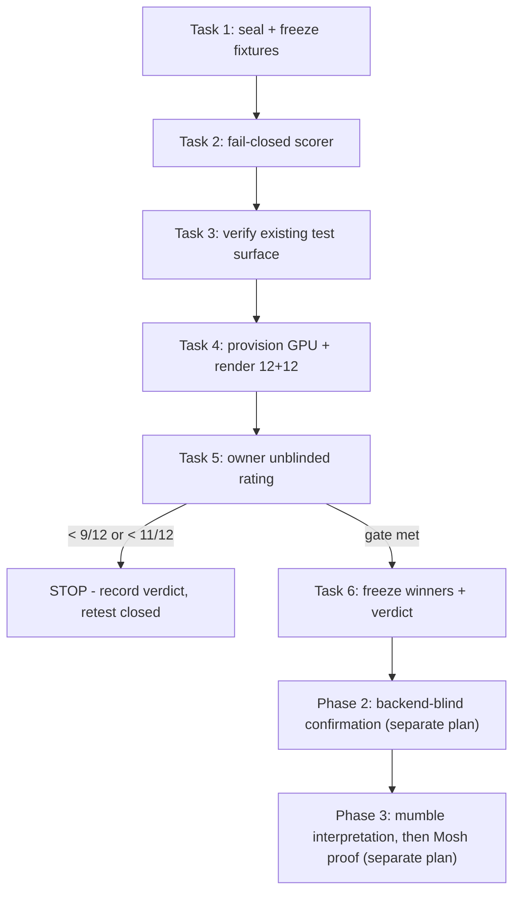

# Finish My Song Retest Implementation Plan

> **For agentic workers:** REQUIRED SUB-SKILL: Use superpowers:subagent-driven-development (recommended) or superpowers:executing-plans to implement this plan task-by-task. Steps use checkbox (`- [ ]`) syntax for tracking.

**Goal:** Determine, by cheap falsification, whether a known-text vocal-replacement renderer can produce a usable scratch vocal on the owner's own material — before any further investment in mumble-lyric inference or product integration.

**Architecture:** Three phases, strictly gated. Phase 1 is a known-text renderer kill-shot: the target words are *given*, so it isolates render quality from the mumble-interpretation problem that failed in 2026-08. It runs on a rented NVIDIA box against three existing owner vocal pairs and is judged by the owner unblinded. Phase 1 failing ends the retest. Phase 1 passing unlocks only Phase 2 — a backend-blind confirmation of the frozen winners — and only Phase 2 may reopen product integration. Phase 3 (mumble interpretation, then one-click Mosh proof) is specified but not authorized by this plan.

**Tech Stack:** Python 3 (stdlib + existing `~/Library/Mosh/venvs/lyrics-bench`), YingMusic-Singer-Plus (~727M params, Stable Audio Open VAE + flow-matching DiT, CUDA-only), a rented NVIDIA GPU box (RunPod-class), the existing `scripts/fms-killshot/` analysis tooling, and the Mosh native gate.

## Scope note

This plan writes the artifact the prior Codex session never reached. That session
asked nine questions in three rounds, received all nine answers, and then hit its
usage limit sixteen seconds later — producing no plan, no branch, and no commits.
Every decision below is the owner's own recorded answer, not a fresh proposal.
**Do not re-ask them.**

## Global Constraints

The nine owner decisions, binding:

1. **Staged re-open.** Run the known-text renderer kill-shot first; stop if it fails; only then unlock mumble interpretation, and only after that the one-click Mosh proof.
2. **Cloud qualify, local ship.** An ephemeral rented NVIDIA box may be used for bakeoffs. Only a local or owner-PC path may ever become the product backend.
3. **Clean lead + challenges.** The denominator counts isolated single-lead articulated takes. Wet/doubled vocals and closed-mouth hums are scored **separately** as challenge cases and never enter the pass denominator.
4. **Span length:** up to 15 seconds per phrase.
5. **Existing assets only.** Reuse the three owner song pairs. Contamination and overfitting risk is accepted knowingly.
6. **Owner unblinded** rates Phase 1.
7. **Pilot claim: require blind confirmation.** Phase 1 is triage. A pass does **not** reopen product integration — it authorizes only a backend-blind confirmation re-run of the frozen winners.
8. **Phase 1 gate:** across 12 supported phrases, **≥9/12 usable on first result** AND **≥11/12 usable with one alternate**.
9. **YingMusic posture: potential product backend** — promotion-eligible if quality passes, subject to a formal license review before any distribution.

Standing constraints:

- **Phase 1 is a cheap falsification round, not a shipping proof.** Existing assets were heavily used in prior tuning and an unblinded owner rating cannot establish generalization. This framing is load-bearing and must survive into the verdict wording.
- **Never open, print, log, or pass to a model** any `*.lyrics*.txt`, `*.words*.json`, `voicebox.db`, or blind `*-KEY.json` file except through the sealed helpers in Task 1. These carry ground truth; leaking them into a prompt or a log invalidates the run.
- Exclude `_archive-contaminated` from every fixture selection.
- Raw audio, renders, ratings, and keys stay **outside git**, under `~/Library/Mosh/audits/2026-08-14-fms-retest/`. Only this plan and the tooling in Task 2 are tracked.
- The gate never discovers the FMS python tests; they must be invoked explicitly (Task 3).
- A rented pod bills until **explicitly terminated**. Terminate on failure paths too.
- No frozen criterion may be weakened after Task 4 begins. Infrastructure errors stay in the denominator.

## Phase gating



Tasks 1–3 need no GPU, no cost, and no owner time — do them first. Task 4 needs the
owner to authorize a rented box. Task 5 needs the owner's ears.

---

### Task 1: Seal and Freeze the Pilot Fixture Set

**Files:**
- Create: `scripts/fms-retest/freeze_fixtures.py`
- Test: `scripts/fms-retest/freeze_fixtures_test.py`

**Interfaces:**
- Consumes: the three existing pairs under `~/mosh-fms-ksb/bench/datasets/own-pairs/` — `stage9orsum` (53.38s, 9.49s window, 145 BPM, 19 truth words), `stage10` (55.02s, 10.25s window, 140 BPM, 18 words), `LookinBack` (47.43s, 7.15s window, 123 BPM, 18 words). All mono PCM16/44.1kHz.
- Produces: `select_phrases(manifest, n) -> list[Phrase]` and a written `frozen.json` consumed by Tasks 4–6. `Phrase` is `{"id": str, "fixture": str, "start_s": float, "end_s": float, "class": "supported"|"challenge"}`.

- [ ] **Step 1: Tighten fixture permissions**

The fixtures are currently world-readable and contain ground truth.

The tree contains subdirectories (`asr-draft/`, `source-aif/`), so a flat
`chmod 600 <dir>/*` would strip their execute bit and make them unenterable.
Split by type:

```bash
find ~/mosh-fms-ksb/bench/datasets/own-pairs -type d -exec chmod 700 {} +
find ~/mosh-fms-ksb/bench/datasets/own-pairs -type f -exec chmod 600 {} +
ls -la ~/mosh-fms-ksb/bench/datasets/own-pairs | head -5
```

Expected: directories `drwx------`, files `-rw-------`, and the subdirectories still enterable.

- [ ] **Step 2: Write the failing test**

```python
# scripts/fms-retest/freeze_fixtures_test.py
import sys
from freeze_fixtures import select_phrases, span_seconds, SPAN_CAP_S

def test_span_cap_is_fifteen_seconds():
    assert SPAN_CAP_S == 15.0

def test_rejects_span_over_cap():
    p = {"id": "a", "fixture": "stage10", "start_s": 0.0, "end_s": 15.01, "class": "supported"}
    try:
        span_seconds(p)
    except ValueError as e:
        assert "15" in str(e)
    else:
        raise AssertionError("expected ValueError for a 15.01s span")

def test_accepts_span_at_cap():
    p = {"id": "a", "fixture": "stage10", "start_s": 0.0, "end_s": 15.0, "class": "supported"}
    assert span_seconds(p) == 15.0

def test_selects_exactly_twelve_supported():
    manifest = [{"id": f"p{i}", "fixture": "stage10", "start_s": 0.0, "end_s": 5.0,
                 "class": "supported" if i < 20 else "challenge"} for i in range(24)]
    out = select_phrases(manifest, 12)
    assert len(out) == 12
    assert all(p["class"] == "supported" for p in out)

def test_challenge_cases_never_enter_denominator():
    manifest = [{"id": "c0", "fixture": "stage10", "start_s": 0.0, "end_s": 5.0, "class": "challenge"}]
    try:
        select_phrases(manifest, 1)
    except ValueError as e:
        assert "supported" in str(e)
    else:
        raise AssertionError("expected ValueError when no supported phrases exist")

def test_selection_is_deterministic():
    manifest = [{"id": f"p{i}", "fixture": "stage10", "start_s": 0.0, "end_s": 5.0,
                 "class": "supported"} for i in range(20)]
    assert [p["id"] for p in select_phrases(manifest, 12)] == [p["id"] for p in select_phrases(manifest, 12)]

if __name__ == "__main__":
    import traceback
    failures = 0
    for name, fn in sorted(globals().items()):
        if name.startswith("test_") and callable(fn):
            try:
                fn(); print(f"PASS {name}")
            except Exception:
                failures += 1; print(f"FAIL {name}"); traceback.print_exc()
    sys.exit(1 if failures else 0)
```

- [ ] **Step 3: Run test to verify it fails**

Run: `cd scripts/fms-retest && python3 freeze_fixtures_test.py`

Expected: FAIL with `ModuleNotFoundError: No module named 'freeze_fixtures'`. A syntax error or an empty run is **not** a valid RED — fix that first.

- [ ] **Step 4: Write minimal implementation**

```python
# scripts/fms-retest/freeze_fixtures.py
"""Freeze the Phase-1 pilot phrase set. Reads only durations and window metadata --
never lyrics or word truth files."""
import hashlib, json, pathlib

SPAN_CAP_S = 15.0
FIXTURES = ("stage9orsum", "stage10", "LookinBack")

def span_seconds(phrase):
    span = float(phrase["end_s"]) - float(phrase["start_s"])
    if span <= 0:
        raise ValueError(f"non-positive span for {phrase['id']}: {span}")
    if span > SPAN_CAP_S:
        raise ValueError(f"span {span}s exceeds the frozen 15s cap for {phrase['id']}")
    return span

def select_phrases(manifest, n):
    supported = [p for p in manifest if p["class"] == "supported"]
    if len(supported) < n:
        raise ValueError(f"need {n} supported phrases, manifest has {len(supported)}")
    for p in supported:
        span_seconds(p)
    return sorted(supported, key=lambda p: p["id"])[:n]

def sha256_file(path):
    h = hashlib.sha256()
    with open(path, "rb") as fh:
        for chunk in iter(lambda: fh.read(1 << 20), b""):
            h.update(chunk)
    return h.hexdigest()

def freeze(manifest_path, out_path, root):
    manifest = json.loads(pathlib.Path(manifest_path).read_text())
    chosen = select_phrases(manifest, 12)
    challenges = [p for p in manifest if p["class"] == "challenge"]
    root = pathlib.Path(root).expanduser()
    audio = {f: sha256_file(root / f"{f}.mumble.wav") for f in FIXTURES}
    pathlib.Path(out_path).write_text(json.dumps({
        "schema": "fms-retest-frozen-v1",
        "span_cap_s": SPAN_CAP_S,
        "gate": {"first_result_min": 9, "with_alternate_min": 11, "denominator": 12},
        "supported": chosen,
        "challenge": challenges,
        "audio_sha256": audio,
    }, indent=2, sort_keys=True) + "\n")
    return chosen
```

- [ ] **Step 5: Run test to verify it passes**

Run: `cd scripts/fms-retest && python3 freeze_fixtures_test.py`

Expected: all six tests print `PASS`, exit 0.

- [ ] **Step 6: Commit**

```bash
git add scripts/fms-retest/freeze_fixtures.py scripts/fms-retest/freeze_fixtures_test.py
git commit -m "test(fms): freeze the phase-1 pilot phrase set"
```

---

### Task 2: Build the Fail-Closed Render Scorer

**Files:**
- Create: `scripts/fms-retest/score_render.py`
- Test: `scripts/fms-retest/score_render_test.py`

**Interfaces:**
- Consumes: `span_seconds` from Task 1; the existing `scripts/fms-killshot/overlap.py` and `energy_compare.py` for waveform comparison.
- Produces: `assert_exact_samples(a_path, b_path) -> None` and `assert_instrumental_null(mix_before, mix_after, vocal_span) -> None`, both raising `ScoreError` on violation, plus a `--frozen/--renders` CLI that applies the exact-sample guard across a render directory and exits nonzero on the first violation. (`assert_instrumental_null` is library-only: it needs the before/after full mixes plus the vocal span in samples, which the render directory does not carry — it is applied at the mix step, not by this CLI.)

The existing killshot tooling does **not** enforce exact-sample-count or
instrumental-null. Those are the two silent-corruption modes that would let a
render look good while having altered the instrumental or drifted in length —
which the scope lock forbids outright ("the instrumental is never regenerated or
altered"). This task adds the missing guards.

- [ ] **Step 1: Write the failing test**

```python
# scripts/fms-retest/score_render_test.py
import struct, sys, tempfile, wave, pathlib
from score_render import assert_exact_samples, assert_instrumental_null, ScoreError

def _wav(path, frames, rate=44100):
    with wave.open(str(path), "wb") as w:
        w.setnchannels(1); w.setsampwidth(2); w.setframerate(rate)
        w.writeframes(b"".join(struct.pack("<h", v) for v in frames))

def test_exact_samples_accepts_identical_length():
    with tempfile.TemporaryDirectory() as d:
        a, b = pathlib.Path(d) / "a.wav", pathlib.Path(d) / "b.wav"
        _wav(a, [0] * 1000); _wav(b, [1] * 1000)
        assert_exact_samples(a, b)  # must not raise

def test_exact_samples_rejects_one_sample_drift():
    with tempfile.TemporaryDirectory() as d:
        a, b = pathlib.Path(d) / "a.wav", pathlib.Path(d) / "b.wav"
        _wav(a, [0] * 1000); _wav(b, [0] * 1001)
        try:
            assert_exact_samples(a, b)
        except ScoreError as e:
            assert "1000" in str(e) and "1001" in str(e)
        else:
            raise AssertionError("a one-sample drift must fail closed")

def test_instrumental_null_rejects_any_change_outside_the_vocal_span():
    before = [0] * 1000
    after = list(before); after[900] = 500          # change outside span 0..800
    try:
        assert_instrumental_null(before, after, (0, 800))
    except ScoreError as e:
        assert "outside" in str(e).lower()
    else:
        raise AssertionError("instrumental change outside the vocal span must fail closed")

def test_instrumental_null_allows_change_inside_the_vocal_span():
    before = [0] * 1000
    after = list(before); after[400] = 500
    assert_instrumental_null(before, after, (0, 800))  # must not raise

if __name__ == "__main__":
    import traceback
    failures = 0
    for name, fn in sorted(globals().items()):
        if name.startswith("test_") and callable(fn):
            try:
                fn(); print(f"PASS {name}")
            except Exception:
                failures += 1; print(f"FAIL {name}"); traceback.print_exc()
    sys.exit(1 if failures else 0)
```

- [ ] **Step 2: Run test to verify it fails**

Run: `cd scripts/fms-retest && python3 score_render_test.py`

Expected: FAIL with `ModuleNotFoundError: No module named 'score_render'`.

- [ ] **Step 3: Write minimal implementation**

```python
# scripts/fms-retest/score_render.py
"""Fail-closed guards the existing killshot tooling does not enforce."""
import wave

class ScoreError(RuntimeError):
    pass

def _frames(path):
    with wave.open(str(path), "rb") as w:
        return w.getnframes()

def assert_exact_samples(a_path, b_path):
    a, b = _frames(a_path), _frames(b_path)
    if a != b:
        raise ScoreError(f"sample-count drift: {a_path} has {a}, {b_path} has {b}")

def assert_instrumental_null(before, after, vocal_span):
    lo, hi = vocal_span
    if len(before) != len(after):
        raise ScoreError(f"length drift: {len(before)} vs {len(after)}")
    for i, (x, y) in enumerate(zip(before, after)):
        if (i < lo or i >= hi) and x != y:
            raise ScoreError(f"instrumental altered outside the vocal span at sample {i}: {x} != {y}")

def _main(argv):
    import argparse, json, pathlib, sys
    ap = argparse.ArgumentParser()
    ap.add_argument("--frozen", required=True)
    ap.add_argument("--renders", required=True)
    ns = ap.parse_args(argv)
    frozen = json.loads(pathlib.Path(ns.frozen).read_text())
    renders = pathlib.Path(ns.renders)
    checked = 0
    for phrase in frozen["supported"]:
        ref = renders / f"{phrase['id']}.reference.wav"
        for variant in ("first", "alternate"):
            got = renders / f"{phrase['id']}.{variant}.wav"
            if not got.exists():
                raise ScoreError(f"missing render {got}")
            assert_exact_samples(ref, got)
            checked += 1
    print(f"OK: {checked} renders passed the exact-sample guard")
    return 0

if __name__ == "__main__":
    import sys
    try:
        sys.exit(_main(sys.argv[1:]))
    except ScoreError as exc:
        print(f"ScoreError: {exc}", file=sys.stderr)
        sys.exit(1)
```

- [ ] **Step 4: Run test to verify it passes**

Run: `cd scripts/fms-retest && python3 score_render_test.py`

Expected: all four tests `PASS`, exit 0.

- [ ] **Step 5: RED-prove the guards**

A guard that cannot fail is worthless. Prove both fail closed by temporarily
neutering them and confirming the suite goes red:

```bash
cd scripts/fms-retest
cp score_render.py /tmp/score_render.orig.py
python3 - <<'PY'
import pathlib
p = pathlib.Path("score_render.py"); s = p.read_text()
p.write_text(s.replace("        raise ScoreError(f\"sample-count drift", "        return  # RED-PROOF\n        raise ScoreError(f\"sample-count drift"))
PY
python3 score_render_test.py; echo "EXPECT NONZERO: $?"
cp /tmp/score_render.orig.py score_render.py && rm /tmp/score_render.orig.py
python3 score_render_test.py; echo "EXPECT ZERO: $?"
grep -c 'RED-PROOF' score_render.py
```

Expected: the neutered run exits nonzero with `test_exact_samples_rejects_one_sample_drift` failing, the restored run exits 0, and the final `grep -c` prints `0`. If it prints anything else, the restore failed — fix it before committing.

- [ ] **Step 6: Commit**

```bash
git add scripts/fms-retest/score_render.py scripts/fms-retest/score_render_test.py
git commit -m "test(fms): fail closed on sample drift and instrumental change"
```

---

### Task 3: Verify the Existing FMS Test Surface

**Files:**
- Test only. No source changes.

**Interfaces:**
- Consumes: the existing FMS python suites. All fifteen paths below were confirmed present on `main` at plan time.
- Produces: a green baseline. If any of these are already red on `main`, that is a **pre-existing** failure — record it and do not attribute it to this retest.

- [ ] **Step 1: Run every FMS python suite**

The cheap gate never discovers these; they must be invoked explicitly.

```bash
python3 service/phonology/phonology_core_test.py
python3 service/lyrics/analyze_test.py
python3 service/lyrics/extract_test.py
python3 service/lyrics/mumble_test.py
python3 service/lyrics/lyric_gen_test.py
python3 service/lyrics/llm_backend_test.py
python3 service/skeleton/skeleton_core_test.py
python3 service/skeleton/align_test.py
python3 service/soulx/soulx_score_test.py
python3 service/soulx/soulx_adapter_test.py
python3 scripts/fms-killshot/segment_v2.py --selftest
python3 scripts/fms-killshot/overlap.py --selftest
for t in scripts/fms-killshot/*_test.py; do python3 "$t" || echo "FAILED: $t"; done
```

Expected: 20 of 22 pass. **Two are already red on clean `main` and are not caused by this work** — verified by checking out `main` at `6fee7100` and running them directly:

- `scripts/fms-killshot/render_hybrid_test.py:66` — `clip = md["score"][0]` → `KeyError: 'score'`
- `scripts/fms-killshot/resing_score_test.py:80` — `clip = res["score"][0]` → `KeyError: 'score'`

Both fail on the same case, `authors one clip — no_asserted_scored_lines`: the authoring path returns a result with no `score` key. Every other assertion in both files passes.

These are the SoulX hybrid-render and resing-scoring path. Phase 1 replaces that renderer with YingMusic and reuses only `overlap.py`, `energy_compare.py`, `segment_stt_check.py` and `make_listening_page.py`, none of which are red — so Phase 1 may proceed. **But do not reuse `render_hybrid` or `resing_score` for any Phase-1 measurement.** A scoring path that can return no `score` key is capable of failing open, so if a later phase needs either, fix the `KeyError` and RED-prove it first.

Full baseline recorded outside git at `~/Library/Mosh/audits/2026-08-14-fms-retest/pre-run-test-baseline.md`. Record any *new* failure verbatim before proceeding — a red beyond these two changes what Phase 1's result can mean.

- [ ] **Step 2: Run the native gate on a clean tree**

```bash
scripts/auto-loop/memory-preflight.sh
scripts/auto-loop/gate.sh native "$PWD" origin/main > ~/Library/Mosh/audits/2026-08-14-fms-retest/fms-native-gate.json
```

Expected: zero native failures. Do not paste any locally observed selftest count into `MOSH_SELFTEST_BASELINE` — counts are environment-dependent.

- [ ] **Step 3: Commit the recorded baseline**

Only the plan's checkbox state changes here; the gate JSON stays outside git.

```bash
git commit --allow-empty -m "chore(fms): record phase-1 pre-run test baseline"
```

---

### Task 4: Provision the Box and Render the Pilot — OWNER GATE

**Files:**
- Create: `scripts/fms-retest/RUNBOOK.md` (the exact commands actually run, written as they are run)

**Interfaces:**
- Consumes: `frozen.json` from Task 1; the guards from Task 2.
- Produces: 12 first-result renders plus 12 alternates, and the challenge-case renders, under `~/Library/Mosh/audits/2026-08-14-fms-retest/renders/`.

**STOP — this task cannot start without the owner.** It spends money on a rented
GPU and it is the point after which no frozen criterion may be weakened.

- [ ] **Step 1: Get explicit owner authorization**

Confirm with the owner: the rented box is authorized, and they accept that
YingMusic-Singer-Plus is **CUDA-only** — its README documents no Apple Silicon
path, so running it on this Mac would itself be an unverified porting experiment
rather than the intended test.

- [ ] **Step 2: Provision and record identity**

Rent one ephemeral NVIDIA box (RTX 4090-class; prior FMS runs cost roughly $1.40 for a ~2-hour, 6-render session). Record the pod ID, image, driver, and GPU in the runbook. **Set a termination reminder immediately** — a pod bills until explicitly terminated, and a previous program lost roughly 61 hours of idle billing to exactly this.

- [ ] **Step 3: Render 12 supported phrases plus one alternate each**

YingMusic-Singer-Plus takes `--ref_audio --melody_audio --ref_text --target_text`.
`ref_audio` is the clean enrollment clip, `melody_audio` the original vocal span,
`target_text` the known words. Drive it from `frozen.json`; never read a
`*.lyrics*.txt` or `*.words*.json` outside the sealed helper.

- [ ] **Step 4: Run the fail-closed guards on every render**

```bash
python3 scripts/fms-retest/score_render.py --frozen ~/Library/Mosh/audits/2026-08-14-fms-retest/frozen.json --renders ~/Library/Mosh/audits/2026-08-14-fms-retest/renders
```

Expected: zero `ScoreError`. Any sample drift or instrumental change is a **failed render**, counted in the denominator — not a retry.

- [ ] **Step 5: Render the challenge cases separately**

Wet/doubled vocals and closed-mouth hums. These are scored and reported but **never** enter the 12-phrase denominator. Note that closed-mouth hum previously yielded ~7 phones per 15s, which defeats the recognizer outright — a poor result here is expected and is not evidence against the renderer.

- [ ] **Step 6: Terminate the pod and confirm**

```bash
# terminate via the provider CLI/console, then confirm no instance remains
echo "pod terminated at $(date -u +%FT%TZ)" >> scripts/fms-retest/RUNBOOK.md
```

- [ ] **Step 7: Commit the runbook**

```bash
git add scripts/fms-retest/RUNBOOK.md
git commit -m "docs(fms): record the phase-1 render runbook"
```

---

### Task 5: Owner Unblinded Rating — OWNER GATE

**Files:**
- Test only. Ratings land outside git.

**Interfaces:**
- Consumes: the renders from Task 4.
- Produces: `ratings.json` under the audit directory, and the Phase 1 verdict.

- [ ] **Step 1: Build the rating page**

Reuse `scripts/fms-killshot/make_listening_page.py` against the render directory. The owner rates **unblinded** by their own decision; the page still records a stable per-candidate ID so Phase 2 can re-run the winners blind.

- [ ] **Step 2: Owner rates all 12 supported phrases**

Each phrase is `usable` or `not usable` on the **first result**, then `usable` or
`not usable` **with one alternate**. Challenge cases are rated separately and
reported apart.

- [ ] **Step 3: Apply the frozen gate**

Pass requires **both**: ≥9/12 usable on first result, **and** ≥11/12 usable with one alternate. Infrastructure errors stay in the denominator. Do not adjust the denominator, drop a phrase, or re-render to improve the number — any of those voids the run.

- [ ] **Step 4: Record the verdict**

If the gate is not met, Phase 1 **fails and the retest ends here**. Write the verdict, say plainly which phrases failed and how, and stop. That is a successful falsification, not a setback — it is the cheapest available answer to the question.

---

### Task 6: Freeze Winners and Write the Verdict

**Files:**
- Create: `docs/superpowers/specs/2026-08-14-fms-retest-phase1-verdict.md`

**Interfaces:**
- Consumes: the ratings and gate result from Task 5.
- Produces: the tracked verdict, and — only on a pass — the frozen winner list that Phase 2 re-runs blind.

- [ ] **Step 1: Write the verdict document**

State the result, the exact numbers, and the standing limits: existing-asset
contamination, unblinded rating, and that **a Phase 1 pass authorizes only the
backend-blind confirmation** — not product integration, not a shipping claim.

- [ ] **Step 2: Note the license position**

The owner chose "potential product backend." The review is already done: [`docs/superpowers/specs/2026-08-14-yingmusic-license-review.md`](../specs/2026-08-14-yingmusic-license-review.md). Carry its §5 conditions into the verdict — in particular that the $1M Stability revenue gate counts **total organizational revenue from any source**, and that shipping requires a visible "Powered by Stability AI" credit. Its one unresolved item is the Stability Acceptable Use Policy's treatment of voice synthesis, which should be read before a Phase-1 pass creates pressure to commit.

- [ ] **Step 3: Commit and open a PR**

```bash
git add docs/superpowers/specs/2026-08-14-fms-retest-phase1-verdict.md
git commit -m "docs(fms): record phase-1 retest verdict"
git push -u origin codex/fms-retest
```

## Deferred to separate plans

**Phase 2 — backend-blind confirmation.** Re-run the frozen winners with backend
identity hidden from the rater. Only this may reopen product integration.

**Phase 3 — mumble interpretation, then the one-click Mosh proof.** This is the
rung that failed in 2026-08. Note what the phoneme probe actually established
before rebuilding anything: the mechanism carries real phonetic signal (top-1
0.45 against a 0.05 shuffled-control floor), it separated cleanly on articulated
mumbles (1.59 sd and 1.78 sd), and every failure on the produced full-mix song
fell on overlapping echo/effect spans — a recognizer front-end failure, not a
metric failure. The unfinished Stage-D blind listening page still sits at
`~/mosh-fms-ksb/phoneme-probe/index.html` with 195 candidates and was never
scored.

## Stop conditions

Stop and report rather than weakening a criterion when: the Phase 1 gate is not
met; a fail-closed guard fires on a render; the rented box cannot run the model;
the license review raises a distribution blocker; or the only apparent fix is to
change the denominator, the span cap, or the gate after Task 4 has begun.
