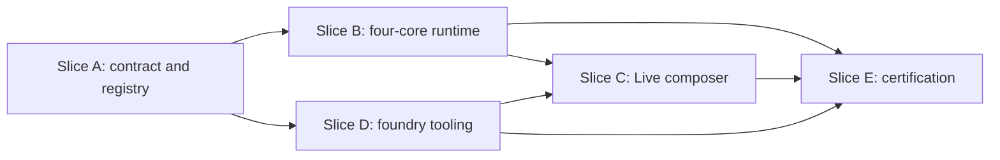

# Moshi Skill Foundry Implementation Plan

> **For agentic workers:** REQUIRED SUB-SKILL: Use superpowers:subagent-driven-development (recommended) or superpowers:executing-plans to implement this plan task-by-task. Steps use checkbox (`- [ ]`) syntax for tracking.

**Goal:** Ship a governed Skill Foundry in which Codex can author bounded producer workflows from rights-cleared evidence, while every executable skill runs and certifies only inside Mosh.

**Architecture:** The program is split into five independently reviewable slices. Slice A establishes the contract and registry; Slices B and D add the four native journeys and bounded Codex/owner tooling; Slice C exposes the shared composer in the Live shell; Slice E adds the certification machinery. After Slice E merges, one clean-main closure run creates the four rights-reviewed curriculum packets, gathers owner evidence, stages approval-bound native resources outside git, and certifies the exact signed app. Ableton remains optional reference evidence and never becomes a runtime or acceptance authority.

**Tech Stack:** TypeScript 5, React 18, Zustand, Vitest, Playwright, Node.js/tsx, Python 3 source-card tooling, C++20, JUCE 8, Tracktion Engine, Catch2, CMake, macOS codesign tooling.

**Spec:** `docs/superpowers/specs/2026-08-14-moshi-skill-foundry-design.md`

## Global Constraints

- Implement one slice per isolated git worktree and PR; never merge. The owner merges each accepted slice before a dependent slice starts.
- Before creating an execution worktree, use `superpowers:using-git-worktrees`; implement with `superpowers:subagent-driven-development` or `superpowers:executing-plans`.
- macOS / Apple Silicon arm64 is the shipping target.
- Every user-visible DAW mutation remains a MoshOps command: validate, identified undo transaction where applicable, events, JSONL, and result envelope.
- Tracktion remains the one undo system. Lifecycle operations never claim atomic rollback.
- Snapshot and event changes are additive; existing consumers remain valid.
- Owner-local manifests are data-only, atomic-only, and limited to the exact V1 catalog in the spec. They cannot contain code, URLs, filesystem paths, environment expansion, retries, or arbitrary commands.
- Ableton, AbletonOSC, `.als` files, tutorials, and source text are reference evidence only. They never execute or certify a skill.
- Raw tutorial media stays local and outside the repository. Store only bounded metadata, short paraphrases, hashes, and local locators.
- Tests use isolated teach and agent roots; they never read or modify the owner's real `~/Library/Mosh/teach` or `$MOSH_AGENT_DIR` data.
- Preserve the boundary among native studio skills, uncertified `skills.ts` candidates, and the offline `service/skills/library.jsonl` corpus.
- The developer free-form loop remains compiled/gated exactly as today and is never a packaged fallback.
- Release builds omit the QA candidate loader and reject candidate-loader flags.
- No secrets, owner media, generated build products, or local attestations enter git.
- Before every native build or test suite, run `scripts/auto-loop/memory-preflight.sh`; stop if it fails.

---

## Plan Set and Dependency Order



| Order | Plan | Independently testable result |
| --- | --- | --- |
| 1 | `docs/superpowers/plans/2026-08-14-moshi-skill-foundry-slice-a-contract-registry.md` | Strict V1 contracts, safe package read, atomic registry construction, bounded declarative execution foundation, and continuation safety. |
| 2a | `docs/superpowers/plans/2026-08-14-moshi-skill-foundry-slice-b-four-core-runtime.md` | Four core journeys execute through the shared registry with honest atomic/lifecycle outcomes. |
| 2b | `docs/superpowers/plans/2026-08-14-moshi-skill-foundry-slice-d-foundry-tooling-source-intake.md` | Codex can safely author candidate/eval artifacts and create, validate, review, approve, install, roll back, revoke, and garbage-collect hermetic local drafts through structured output. |
| 3 | `docs/superpowers/plans/2026-08-14-moshi-skill-foundry-slice-c-live-shell-composer.md` | The existing shared Moshi composer, task drawer, and change toast are reachable in the Live shell with Pro Tools parity. |
| 4 | `docs/superpowers/plans/2026-08-14-moshi-skill-foundry-slice-e-certification-owner-proof.md` | Frozen benchmarks, native/package/physical gates, four curriculum packets, owner approval, and exact post-merge signed-bundle verification promote the four journeys. |

Slices B and D may run in parallel only after Slice A is merged. Slice C starts after both B and D are merged: it has a functional dependency on Slice B's runtime (`runStudioSkill`, the string-token continuation contract, and `createStudioSkillRuntimeV1`), plus a textual dependency on Slice D's one-line `ui/package.json` addition (the `"teach-moshi"` script), which Slice C must preserve byte-for-byte while adding its own built-refusal script. Slice B itself makes no `ui/package.json` changes. Slice E starts only after A-D are merged.

## Program Execution Protocol

### Task 1: Deliver Slice A

**Files:**
- Read: `docs/superpowers/plans/2026-08-14-moshi-skill-foundry-slice-a-contract-registry.md`
- Verify: `docs/superpowers/specs/2026-08-14-moshi-skill-foundry-design.md`

**Interfaces:**
- Produces: the exact V1 artifact, registry, package-read, atomic-execution, and continuation interfaces consumed by every later slice.
- Consumes: existing MoshOps transaction protocol, WebBridge native integration, `MOSH_AGENT_DIR` root convention, and current studio-skill boundaries.

- [ ] **Step 1: Create the isolated execution worktree**

Invoke `superpowers:using-git-worktrees`, branch from current `main`, and name the branch `codex/moshi-skill-foundry-a`.

- [ ] **Step 2: Execute every Slice A checkbox with TDD**

Use `superpowers:subagent-driven-development` unless the owner chooses inline execution. Do not start Slice B, C, D, or E work in the same worktree.

- [ ] **Step 3: Run the Slice A final gate**

Run the exact focused commands in the slice plan, then:

```bash
scripts/auto-loop/memory-preflight.sh
scripts/auto-loop/gate.sh native "$PWD" origin/main
```

Expected: all Slice A contract, loader, registry, and transaction tests pass; the gate reports zero native failures.

- [ ] **Step 4: Open the Slice A PR and stop**

Push the branch and open a PR containing only Slice A. Record exact test tallies and wait for owner merge.

### Task 2: Deliver Slices B and D

**Files:**
- Read: `docs/superpowers/plans/2026-08-14-moshi-skill-foundry-slice-b-four-core-runtime.md`
- Read: `docs/superpowers/plans/2026-08-14-moshi-skill-foundry-slice-d-foundry-tooling-source-intake.md`

**Interfaces:**
- Consumes: the merged Slice A contracts and registry APIs without renaming them.
- Produces: the four core native handlers and the complete owner/Codex authoring CLI used by Slice E.

- [ ] **Step 1: Rebase both starts on the main that contains Slice A**

Create independent `codex/moshi-skill-foundry-b` and `codex/moshi-skill-foundry-d` worktrees. Neither branch may import unmerged files directly from the other.

- [ ] **Step 2: Execute each slice plan independently**

Use one review loop and one commit series per worktree. Keep runtime code out of D and foundry filesystem/process code out of B.

- [ ] **Step 3: Run each slice's focused and native gates**

From each B and D worktree, run `scripts/auto-loop/gate.sh native "$PWD" origin/main` independently after its focused tests pass.

- [ ] **Step 4: Open two independent PRs and stop**

The owner may review/merge B and D in either order because both consume only A.

### Task 3: Deliver Slice C

**Files:**
- Read: `docs/superpowers/plans/2026-08-14-moshi-skill-foundry-slice-c-live-shell-composer.md`

**Interfaces:**
- Consumes: the merged Slice B registry-aware composer behavior.
- Produces: Live-shell reachability with the same `AgentComposer`, `AgentDrawer`, `ChangeToast`, and semantic outcomes as Pro Tools.

- [ ] **Step 1: Start from main after Slices B and D merge**

Create `codex/moshi-skill-foundry-c` with `superpowers:using-git-worktrees`. Preserve D's `teach-moshi` script while adding C's built-refusal script.

- [ ] **Step 2: Execute the component and Playwright TDD tasks**

Do not fork or duplicate agent logic. The Live wrapper owns layout, focus, Escape, and focus return only.

- [ ] **Step 3: Run focused UI, packaged-boundary, and native gates**

Run every command named in the Slice C plan and the repository native gate before opening the PR.

- [ ] **Step 4: Open the Slice C PR and stop for owner merge**

### Task 4: Deliver Slice E, Then Close the Program on Merged Main

**Files:**
- Read: `docs/superpowers/plans/2026-08-14-moshi-skill-foundry-slice-e-certification-owner-proof.md`

**Interfaces:**
- Consumes: all merged A-D runtime, CLI, shell, artifact, and registry interfaces.
- Produces: certification code in the Slice E PR, then post-merge frozen reports, manual checkpoints, owner-bound approval, externally staged native bundle entries, and external signed-bundle verification.

- [ ] **Step 1: Start from main after A-D merge**

Create `codex/moshi-skill-foundry-e`; confirm the required A-D symbols and tests exist before editing.

- [ ] **Step 2: Implement and test the certification machinery**

Implement the frozen-suite generator, graders, Mosh driver, QA-only candidate mode, package gates, and owner/reference validators. Commit all tracked code and documentation; never commit local evidence or approved native resource bytes.

- [ ] **Step 3: Open the Slice E implementation PR and stop for owner merge**

Run the focused and native gates against the clean PR head. Any correction must be committed and followed by the complete gate again. Do not create owner approval or final-release evidence from a pre-merge identity.

- [ ] **Step 4: Start the closure run from clean merged main**

After the owner merges Slice E, verify a clean tree and freeze the exact git/app/build identity. Create the four five-artifact curriculum packets and the immutable benchmark before repairs. Never weaken, drop, or change a case denominator after execution begins. Any tracked-code change invalidates the run and returns to Step 3 through a new PR.

- [ ] **Step 5: Exit at manual checkpoints**

When physical/taste evidence is required, preserve the run and return `needs_manual_evidence`. Do not wait, synthesize an approval, or treat an earlier architecture approval as skill approval.

- [ ] **Step 6: Run the optional Ableton block only if needed**

Use one isolated scratch Set for the four separately checkpointed journeys. Record local reference locators and ambiguity notes only; do not capture an executable Ableton trace.

- [ ] **Step 7: Verify the exact final signed app**

After explicit owner approval, stage generated native resources outside git, run the full release/sign/notarize/staple path, and run both-shell installed-app checks against that exact app. Only then emit `NativeReleaseVerificationV1` outside the bundle it hashes and record native `certified` transitions. Any code, approval, resource, signature, or bundle change invalidates this proof.

- [ ] **Step 8: Record the local closure result**

The program may claim completion only when merged main remains the proven build identity, all four native journeys are certified, and the exact installed app satisfies the completion claim in the spec. The evidence stays owner-local and no commit follows it.

## Program Stop Conditions

Stop a slice and report a blocker when a required MoshOps/resolver primitive is missing, source rights are unresolved, the same blocker repeats for three repair cycles, hardware or owner judgment is required, or the only proposed fix weakens frozen acceptance criteria. A blocked slice does not authorize work from a dependent slice.

## Deferred Work

Do not add drum/MIDI sketching, sends/effects, clip warp, Re-imagine, automation, export, AbletonOSC integration, runtime web browsing, transcript scraping, fine-tuning, sharing/marketplace behavior, arbitrary scripts, or bulk certification of existing catalogs in these plans.
